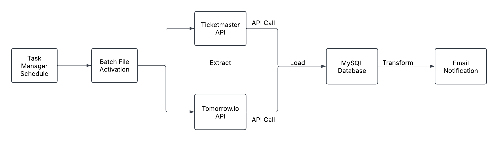

# ADS507_Project_g4
 This Github repository is for group 4 during Spring '25. 

 Members: Austin Mallie, Cynthia Portales-Loebell, and Graham Ward

## Overview
The goal of this project is to create a production ready Extraction, Transform, and Load (ETL) pipeline for USD's MS ADS Practical Data Engineering course. ADS507.

This pipeline extracts event and venue data from the Ticketmaster API for all events in San Diego in the next five (5) days. Additionally, this pipeline extracts hourly weather forecast information for San Diego, CA from Tomorrow.io for the next five (5) days.
As the data is extracted from the API's it is immediately loaded into the established Microsoft Azure MySQL database, with only minimal transformations to ensure a standardized time format, which will allow us to perform join operations on the weather and event tables. Once the data is loaded into the normalized tables, a SQL query is then performed where transformations, such as unit conversions are applied as the data leaves the databse. The final output is a automatic notification email that contains a formatted table with all of the events and associated weather forecasts for each event that is occurring within the next five (5) days. A batch file exists to aid in the automation of selecting the correct environment and executing the python notebook in its entirety. Microsoft Task Scheduler executes the batch file, which in turn processes the Jupyter Notebook, automating the entire pipeline at 12:01AM every Weekday.

## Features
- **Data Extraction:**
    - Extracts data from Ticketmaster and Tomorrow.io API's

- **Data Loading:**
    - Loads data into a Microsoft Azure MySQL flexible server while performing only minimal DATETIME standardization transformations.

- **Data Transformation:**
    - During SQL querying for the final email notification, transformations are applied as the data comes from the database and is converted into a dataframe and then transformed into an HTML table.

- **Automation:**
    - Windows Task Scheduler and a batch file automate the process of activating the correct anaconda environment and running the jupyter notebook containing the code.

- **Output:**
    - An email notification with a table containing all the events and weather forecasts is sent to emails in the recipient emails section of the .env file.
    - The pipeline is set to run every weekday at 12:01AM Pacific Standard Time. (UTC -8)

## System Architecture

- **Data Sources:**
    - Discovery API (Ticketmaster): Provides all venue and event details over the next five days.
    - Tomorrow.io API (Weather): Provides all hourly weather forecast information over the course of the next five days.

- **Pipeline:**
    - Extraction: Extracts both Ticketmaster and Weather forecast infomration from a JSON format.
    - Loading: Loads the data into a MySQL database with only minor transformations along the way to standardize DATETIME information.
    - Transform: Performs a SQL query and transformations to include unit conversions from celsius and km/h to fahrenheit and mph.

- **Output:**
    - SQL Query is performed and tables are joined into a dataframe which is then converted into an HTML table.
    - Email function sends the HTML formatted output to an email list via Secure Message transfer Protocol and Gmail servers
    - Output is every event and associated weather forecast over the course of the next five (5) days.

- **Automation:**
    - A batch file triggers the execution of the whole program via the Windows Task Scheduler.

## Installation and Setup
In order to establish your environment correctly and configure the environment to run the code with minimal issues, please ensure the following packages and dependencies have been downloaded.

### Prerequisites
    - Python 3.12+
    - Anaconda distribution or other environment manager
    - MySQL database that conforms to the schema listed below
    - Windows Task Scheduler

### Libraries and Packages
    - Pandas
    - Requests
    - Matplotlib
    - MySQL.connector
    - python-dotenv
    - Jupyter
    - Smtplib
    - datetime
    - email.mime

### Environment Variables
In order for this code to run smoothly, the creation of a .env file in the same folder as this project is required. Please include the following variables in the same case as below
- **API Keys:**
    - TICKETMASTER_API_KEY=your_ticketmaster_api_key
    - TOMORROW_API_KEY=your_tomorrow_api_key

- **MySQL Credentials:**
    - MYSQL_HOST=your_azure_mysql_host
    - MYSQL_USER=your_mysql_user
    - MYSQL_PASSWORD=your_mysql_password
    - MYSQL_DATABASE=your_mysql_database

- **Email Credentials/List:**
    - SENDER_EMAIL=your_dedicated_email@gmail.com
    - SENDER_PASSWORD=your_app_specific_password
    - RECIPIENT_EMAILS="recipient1@example.com,recipient2@example.com"

**Gmail which is what this code was designed to run with requires you to develop a app specific password within the specific gmail account that you want to send the emails from.**

## Program Execution
This program can be run manually from the command line via a .bat file or in an interactive viewer such as VS Code or scheduled for automation through the use of a batch file (.bat) that resides in the same folder as the Jupyter Notebook and the .env file in conjunction with the .

**Manual Operation**

    - This file can be run through an interactive viewer such as VS Code.
    - Navigate to the folder where the notebook, the .env file, and the .bat file are located in the Command Prompt
    - Run the .bat file which should run the notebook in its entirety.

**Task Scheduler/Automation**

    - The implementation of the .bat file can automate the process of running the Jupyter Notebook with the assistance of the Task Scheduler and creation of an automated task.

## MySQL Database Schema
Our database is hosted on a Microsoft Azure flexible MySQL server. Three tables were developed to house the data that would be extracted from the Ticketmaster and Tomorrow.io API's. A view of the database schema can be found below.

**Venues Table**
Houses information from the Ticketmaster Discovery API for data pertaining to the venues for the events of the week
- venue_id: Unique venue identifier (Primary Key)
- name: Venue name
- city: Venue city
- state: Venue state
- country: Venue country
- location: string of latitude and longitude

**Events Table**
Stores event information within San Diego over the next five(5) days. Contains a foreign key association to venue_id
- event_id: unique event identification number from Ticketmaster. (Primary Key)
- name: Event name
- start_date: DATETIME of the event.
- venue_id: Foreign key, to the venue_id in Venues table
- category: Category of the event

**Weather Forecasts Table**
Stores information on the hourly forecasts for the next five(5) days, which equates to 120 weather forecasts.
- forecast_id: unique forecast identifier, 1-120 (Primary Key)
- forecast_time: DATETIME of the forecast
- forecast_temperature: Temperature, this code inputs the temperature into the database in celsius but the final product is in Fahrenheit
- forecast_temp_apparent: Feels like temperature, to include water content in air. Temperature in celsius in the database in final product it is in Fahrenheit.
- forecast_humidity: The percentage humidity at the time of the forecasted.
- rain_intensity: How much rain in millimeters forecasted at the time.
- forecast_winds: Wind speed forecasted at that time. In database it is in km/hr and in the output it is in mph
- weather_code: Weather code indicating the predominant weather at the time of the forecast.
- weather_icon: The associated weather icon for the predominant weather at the time of the forecast, links to a github repository for Tomorrow.io weather icons.

## System Diagram

## License

## Notes
The icons in this application are powered by Tomorrow.io Github repository which can be found at this [Repository](https://github.com/Tomorrow-IO-API/tomorrow-weather-codes/tree/master/V1_icons/color)